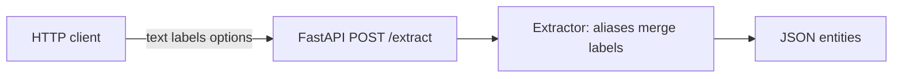
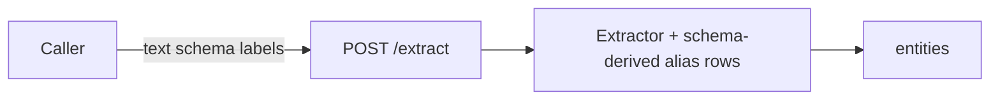
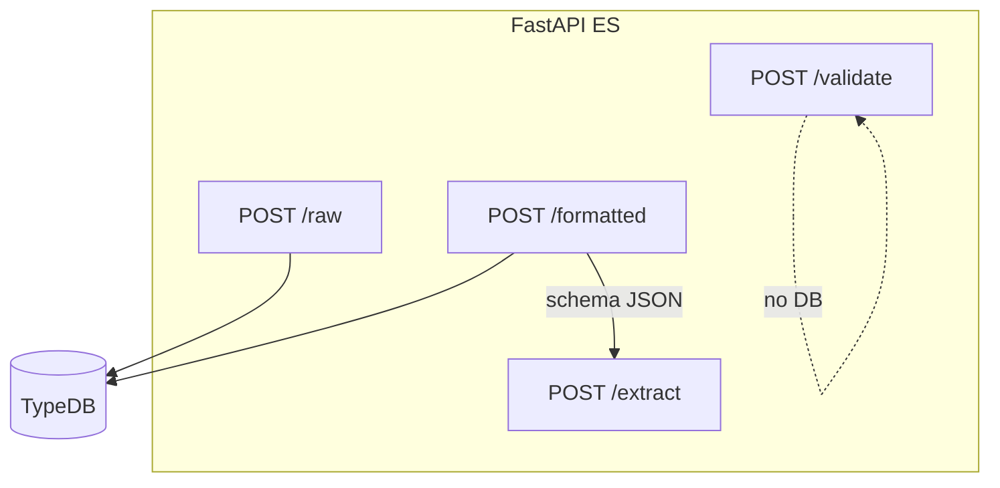
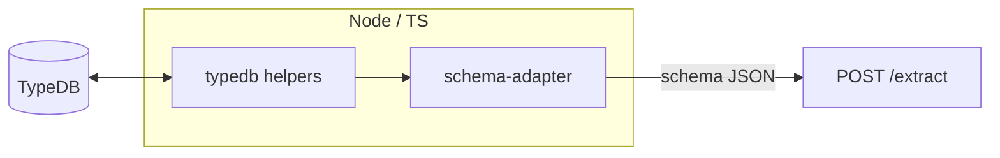
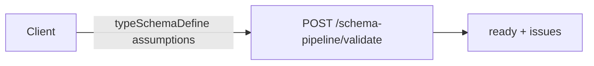
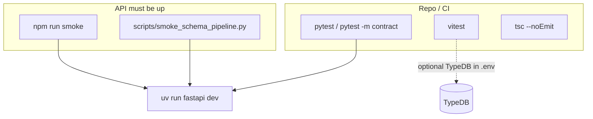
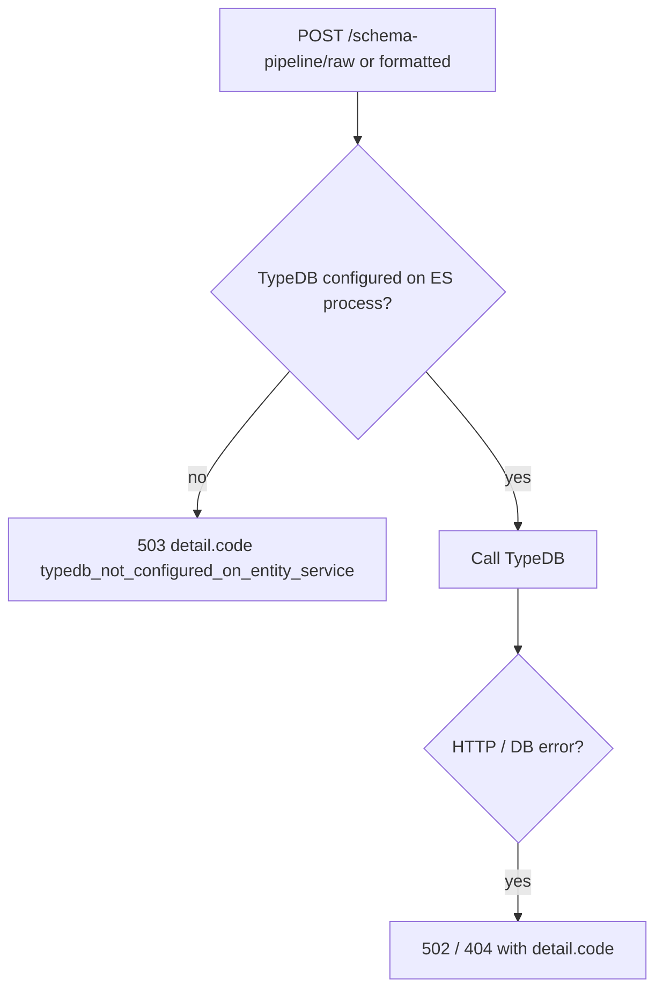

# Entity service (ES) — workflows and diagrams

This document complements **[`USER_AND_AGENT_GUIDE.md`](./USER_AND_AGENT_GUIDE.md)** (contracts, env, troubleshooting) with **decision-oriented** views: what runs where, and which paths touch TypeDB.

**Legend:** **ES** = this FastAPI app. **TypeDB** = database (Cloud or CE). **TS** = TypeScript in `src/`.

---

## 1. Which workflow am I using?

| You need… | TypeDB in ES process? | TypeDB in Node/TS? | Primary HTTP calls |
|-----------|------------------------|---------------------|---------------------|
| NER only, no catalog | No | No | `POST /extract` |
| NER + runtime vocabulary from your app | No | Optional | `POST /extract` + `schema` body |
| NER + live define alignment on ES | **Yes** (`TYPEDB_*` on ES) | Optional | `POST /extract` with **`useTypeDbTypes`: true** (read-only define fetch; **`typeCandidates`** + optional **`labelCandidates`**) |
| Raw define + validate + `schema` from **Python** | **Yes** (`TYPEDB_*` on ES) | Optional elsewhere | `POST /schema-pipeline/raw` → `validate` → `formatted` → `POST /extract` |
| Build `schema` in **TypeScript** | No | **Yes** | TS → TypeDB; then `POST /extract` |

**Rules:** **`POST /extract`** does **not** write to TypeDB. By default it does **not** open TypeDB either. With **`useTypeDbTypes`: true**, Python opens a **read-only** HTTP session for the define type schema on the same process. **`/schema-pipeline/*`** always uses read-only TypeDB when env is set.

---

## 2. Workflow A — Extract only (minimal)

No `schema`, no TypeDB. Aliases from `app/config/aliases.py` (+ optional GLiNER if enabled).



---

## 3. Workflow B — Extract + client `schema`

Caller (any HTTP client or TS) sends **`schema`** with `entityTypes` / `knownEntities`. No TypeDB unless **`useTypeDbTypes`** is **`true`**.



---

## 4. Workflow C — Schema pipeline on ES (optional TypeDB)

Use when the **same machine/process** as FastAPI has **`TYPEDB_*`** and you want ES to read define text and samples, then emit a **`schema`** for `/extract`.

```mermaid
sequenceDiagram
  participant Client
  participant ES as FastAPI ES
  participant TDB as TypeDB HTTP

  Client->>ES: POST /schema-pipeline/raw
  ES->>TDB: type-schema + bounded queries
  TDB-->>ES: define + samples
  ES-->>Client: typeSchemaDefine perType …

  Client->>ES: POST /schema-pipeline/validate
  Note over ES: No live DB; body carries define text
  ES-->>Client: ready issues

  Client->>ES: POST /schema-pipeline/formatted
  ES->>TDB: queries per entity type
  TDB-->>ES: rows
  ES-->>Client: entityTypes knownEntities

  Client->>ES: POST /extract schema from formatted
  ES-->>Client: entities
```



---

## 5. Workflow D — TypeScript–first (TypeDB only in Node)

GrooveGraph / apps often use **`src/typedb/`** + `@typedb/driver-http` and send **`schema`** on **`/extract`**. Alternatively, with **`TYPEDB_*`** on ES, **`useTypeDbTypes`: true** on **`/extract`** performs a read-only define fetch for **`typeCandidates`** / label alignment without building **`schema`** in Node first.



---

## 6. Workflow E — Validate without live DB

Offline check of define text + ER assumptions (no credentials needed on caller for this step).



---

## 7. Testing and smoke (where things run)



---

## 8. Observability (request tracing)

Every HTTP request is logged under the **`app`** loggers with a shared **`request_id`** (and **`X-Request-Id`** on the response). **`POST /extract`** also emits **`extract_done`** with counts (full request JSON at **DEBUG** when enabled). Env vars: **`docs/USER_AND_AGENT_GUIDE.md`** §8.

---

## 9. Failure routing (operational)



See **`docs/USER_AND_AGENT_GUIDE.md`** §3 for stable **`detail`** shapes.

---

## Related files

| Area | Path |
|------|------|
| Request tracing | `app/middleware/request_trace.py`, `app/logging_setup.py`, `app/request_context.py` |
| Extract | `app/routes/extract.py`, `app/services/extractor.py` |
| Schema pipeline | `app/routes/schema_pipeline.py`, `app/services/schema_pipeline.py` |
| TS TypeDB | `src/typedb/*` |
| Smoke | `scripts/smoke_schema_pipeline.py`, `src/test-ner.ts`, `npm run smoke*` |

When you add a new **HTTP-facing** flow, update this document and the handbook so integrators keep one mental model.
